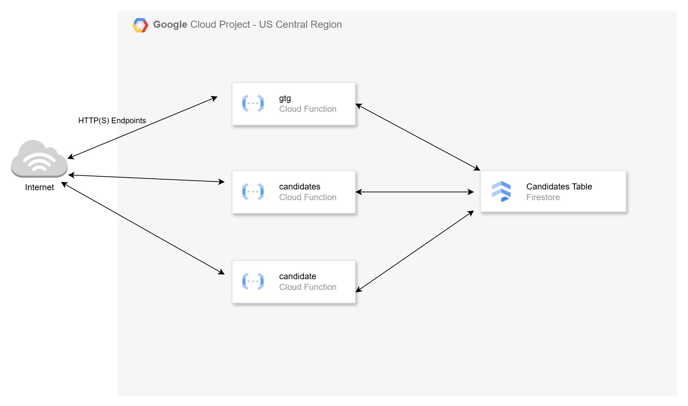
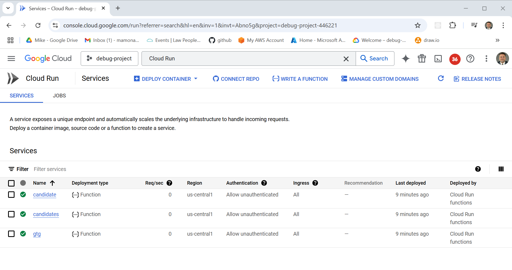
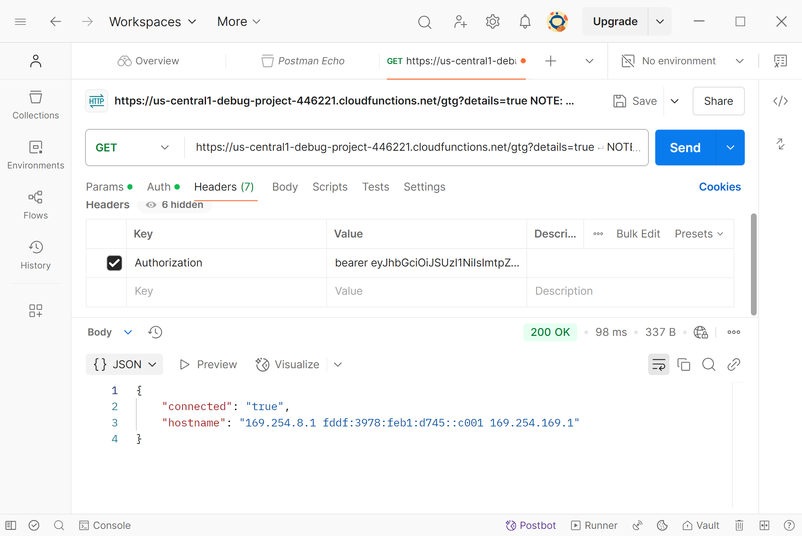

# Deploying Serverless HTTP Endpoints with GCP Cloud Functions

This video is a follow-up to the [GCP Managed Instance Groups](https://youtu.be/AAOZOhREc5o) tutorial, where we deployed a Python microservice using the Flask framework and managed it with GCP Instance Groups.

In this video, we will deploy a set of Python-based serverless functions using **GCP Cloud Functions**. The goal is to replicate the functionality of the API from the [GCP Managed Instance Groups project](https://github.com/mamonaco1973/gcp-flask-mig/blob/main/README.md) using Cloud Functions.

By the end of this video, you’ll learn how to deploy Python-based HTTP endpoints as Cloud Functions using **Terraform**.

### Key Tasks Covered

1. **Deploy Python Code**: Build microservices using GCP Cloud Functions.
2. **Utilize Firebase**: Use Firebase as a document database for microservice data storage.
3. **Secure HTTP Endpoints**: Protect endpoints using a signed JWT (JSON Web Token)
4. **Clean Up Resources**: Safely destroy all infrastructure created during deployment.

## Serverless Computing with Google Cloud Functions

**Serverless computing** is a cloud-computing execution model where **Google Cloud** dynamically manages the infrastructure, including server provisioning, scaling, and maintenance. This approach allows developers to focus entirely on writing and deploying code without the need to manage or maintain underlying servers. A key use case for serverless computing is building and managing **HTTP endpoints**, making it a powerful solution for web applications, APIs, and microservices.

### Key Characteristics of Google Cloud Functions

- **No Server Management**: Developers don't need to manage or provision servers; Google Cloud handles the underlying infrastructure, allowing more focus on application logic.
- **Automatic Scaling**: Google Cloud Functions automatically scale up or down based on demand, ensuring consistent performance regardless of traffic volume.
- **Pay-As-You-Go**: Costs are based on actual usage (e.g., number of requests, function execution time, and memory allocation), providing cost-efficiency for workloads with varying traffic patterns.

### Google Cloud Functions for Serverless HTTP-Based Solutions

Serverless computing in Google Cloud is powered by **Google Cloud Functions**, a Functions-as-a-Service (FaaS) platform that simplifies the development and deployment of serverless applications.

- **Google Cloud Functions**: Executes code in response to HTTP(S) requests or other event triggers, without the need to provision or manage servers. Cloud Functions automatically scale to handle varying levels of traffic and are billed based on the execution time, memory usage, and number of invocations.

- **HTTP Triggers**: Google Cloud Functions natively support HTTP(S) triggers, making them an ideal choice for building RESTful APIs, webhooks, and other HTTP-based services. These triggers allow functions to securely and efficiently handle incoming HTTP requests.


Google Cloud Functions enable developers to build scalable, cost-effective, and fully serverless web applications, APIs, and microservices, empowering teams to deliver solutions faster while minimizing infrastructure overhead.




## Prerequisites

* [A Google Cloud Account](https://console.cloud.google.com/)
* [Install gcloud CLI](https://cloud.google.com/sdk/docs/install) 
* [Install Latest Terraform](https://developer.hashicorp.com/terraform/install)

If this is your first time watching our content, we recommend starting with this video: [GCP + Terraform: Easy Setup](https://youtu.be/3spJpYX4f7I). It provides a step-by-step guide to properly configure Terraform, Packer, and the gcloud CLI.

## Download this Repository

```bash
git clone https://github.com/mamonaco1973/gcp-flasky-cloud-functions.git
cd gcp-flasky-cloud-functions
```

## Build the Code

Run [check_env](check_env.sh) then run [apply](apply.sh).

```bash
~/gcp-flasky-cloud-functions$ ./apply.sh
NOTE: Validating that required commands are found in the PATH.
NOTE: gcloud is found in the current PATH.
NOTE: packer is found in the current PATH.
NOTE: terraform is found in the current PATH.
NOTE: All required commands are available.
NOTE: Validating credentials.json and test the gcloud command
Activated service account credentials for: [terraform-build@debug-project-446221.iam.gserviceaccount.com]
NOTE: Zipping cloud function source into functions.zip.
  adding: requirements.txt (stored 0%)
  adding: main.py (deflated 74%)
NOTE: Building the cloud functions with Terraform.
Initializing the backend...
Initializing provider plugins...
- Finding latest version of hashicorp/google...
- Finding latest version of hashicorp/random...
- Installing hashicorp/google v6.17.0...
- Installed hashicorp/google v6.17.0 (signed by HashiCorp)
- Installing hashicorp/random v3.6.3...
- Installed hashicorp/random v3.6.3 (signed by HashiCorp)
Terraform has created a lock file .terraform.lock.hcl to record the provider
selections it made above. Include this file in your version control repository
so that Terraform can guarantee to make the same selections by default when
you run "terraform init" in the future.

Terraform has been successfully initialized!
[...]
```

### Build Process Overview

The build process consists of two distinct phases:

#### 1. Packaging the Python Code
- The Python code is compressed into a ZIP file during this phase.
- A checksum of the ZIP file is generated to detect code changes in subsequent builds.

#### 2. Deploying the Infrastructure
- Terraform code is executed to deploy the Cloud Functions and the storage bucket for the code.
- A role is assigned to grant the Cloud Functions access to Firebase.

#### Final Validation
- Once the build is complete, the [`validate.sh`](validate.sh) script is run to verify the solution and ensure all components are functioning as expected.

## Tour of Build Output in the GCP Console

Most of the build can be accessed on the **Cloud Run** page of the GCP Console.



## *Flasky* Endpoint Summary

- [Cloud Function Source Code](./01-cloudfunctions/code/main.py)

### `/gtg` (GET)
- **Purpose**: Health check.
- **Response**: 
  - `{"connected": "true", "instance-id": <instance_id>}` (if `details` query parameter is provided).
  - 200 OK with no body otherwise.

### `/candidate/<name>` (GET)
- **Purpose**: Retrieve a candidate by name.
- **Response**: 
  - Candidate details (JSON) with status `200`.
  - `"Not Found"` with status `404` if no candidate is found.

### `/candidate/<name>` (POST)
- **Purpose**: Add or update a candidate by name.
- **Response**: 
  - `{"CandidateName": <name>}` with status `200`.
  - `"Unable to update"` with status `500` on failure.

### `/candidates` (GET)
- **Purpose**: Retrieve all candidates.
- **Response**: 
  - List of candidates (JSON) with status `200`.
  - `"Not Found"` with status `404` if no candidates exist.

## Securing HTTP Endpoints with Google Cloud Authentication Headers

In the initial deployment of this project, the HTTP endpoints were deployed without any access controls, allowing anyone on the public internet to connect to them. In this section, we will secure the endpoints using Google Cloud authentication headers and test the setup with Postman.

Google Cloud authentication headers provide an additional layer of security by requiring a signed JWT (JSON Web Token) or an identity token to be included in the request header for access. This ensures that only authorized clients can invoke the endpoints.

### Steps to Secure and Test the Endpoints

#### 1. Modify the `anonymous` Variable

Update the `anonymous` variable in the [01-cloudfunctions\variables.tf](01-cloudfunctions\variables.tf) file to **true**.

```tf
# Boolean Variable for Anonymous Access
# Determines whether to enable anonymous access to the deployed Cloud Functions (public invocation).
variable "anonymous" {
  description = "Enable anonymous access to Cloud Functions (allUsers can invoke the functions)" # Description of the variable.
  type        = bool  # Data type of the variable (boolean).
  default     = false  # Default value set to 'true' to allow public invocation.
}
```
#### 2. Apply the Terraform Configuration

Run the `apply.sh` script to re-deploy the infrastructure with the updated authorization setting.

#### 3. Validate Authentication Enforcement

Run the `validate.sh` script. You should see Forbidden errors for all API requests because function key is now required. **NOTE** it may take several minutes for the authorization to be enabled after the apply script.

```bash
~/gcp-flasky-cloud-functions$ ./validate.sh
Activated service account credentials for: [terraform-build@debug-project-446221.iam.gserviceaccount.com]
NOTE: Bearer token if not deployed anonymous

bearer <LONG_TOKEN>

NOTE: Health check endpoint is https://us-central1-debug-project-446221.cloudfunctions.net/gtg?details=true
✗ good to go failed: Forbidden
✗ insert failed: Forbidden
✗ verification failed: Forbidden
✗ candidate list failed: Forbidden

```
#### 4. Test APIs with Postman using the key output from `validate.sh`

Use Postman to test the endpoints by setting the `Authorization` header with a value of "bearer <TOKEN>". This value is displayed in the `validate.sh` output and is valid for 1 hour after running the validate script.



